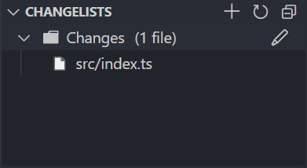

# Git Changelists

Extension for VSCode adding feature of Changelists GUI. Under the hood it's just few GIT tricks and commands.

  

### Features

- Create, Rename, Delete changelists
- Add, Remove unstaged files to changelist (via context menu)

Each file that is tracked by git when added to chagelist will be processed through command `git update-index --assume-unchanged filepath`.
Or through `git update-index --no-assume-unchanged filepath` when removed from changelist.

### Known Issues

- This extension may have some parsing issues, and code will be refactored sooner or later.

### Release Notes

#### [Change Log](./CHANGELOG.md)
